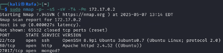
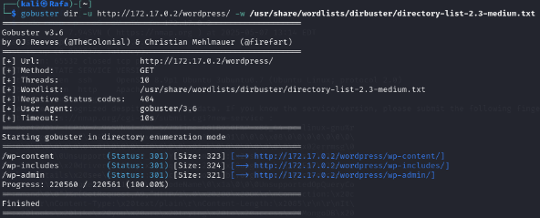
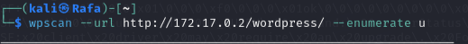
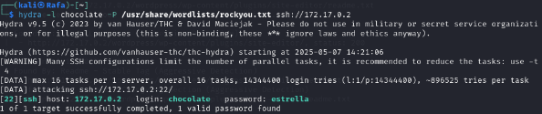
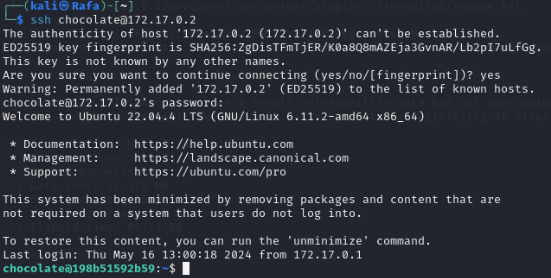
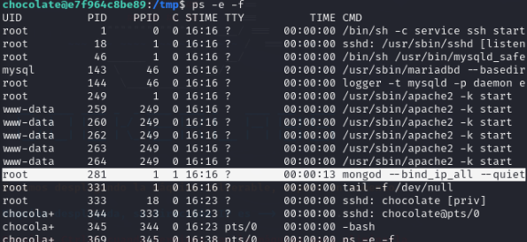
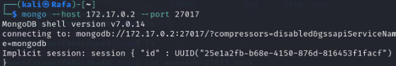
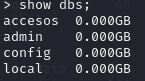
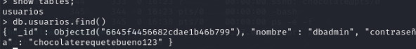
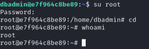

# Informe Técnico – Máquina Collections (DockerLabs)

## 1. Introducción
En este informe se documenta la resolución de la máquina **Collections** de DockerLabs.

El objetivo ha sido realizar un proceso completo de reconocimiento, explotación y escalada de privilegios en un entorno controlado.

---

## 2. Reconocimiento inicial
Se realizó un escaneo inicial con Nmap para identificar los puertos y servicios expuestos.

Se detectaron los siguientes puertos:

- 22 → SSH
- 80 → HTTP
- 27017 → MongoDB

---

## 3. Enumeración web
Se utilizó WhatWeb y Gobuster para identificar la tecnología del servicio web y descubrir rutas accesibles.

Se confirmó la presencia de una instalación de WordPress usando Gobuster y posteriormente sacamos otras rutas extra.

---

## 4. Enumeración de usuarios WordPress
Mediante WPScan se identificó el usuario:

- `chocolate`

---

## 5. Acceso inicial
Se obtuvo acceso inicial al sistema usando Hydra.

Iniciamos sesión mediante SSH con las credenciales:

- Usuario: `chocolate`
- Contraseña: `estrella`

---

## 6. Enumeración interna
Una vez dentro del sistema, se localizaron archivos temporales y procesos relacionados con MongoDB.

Se observó que el proceso `mongod` se estaba ejecutando con privilegios elevados.

---

## 7. Acceso a MongoDB
Se realizó conexión al servicio MongoDB y se enumeraron las bases de datos disponibles.

Se identificó la base de datos:

- `accesos`

---

## 8. Extracción de credenciales
Dentro de la base de datos se extrajeron credenciales sensibles:

- Usuario: `dbadmin`
- Contraseña: `chocolaterequetebueno123`

---

## 9. Escalada de privilegios
Desde el usuario **chocolate** al cual obtuvimos acceso anteriormente haremos la escalada de privilegios entrando a **dbadmin** y posteriormente a **root** haciendo `su root`.

Finalmente se consiguió acceso como root utilizando:

- Contraseña: `chocolaterequetebueno123`

---

## 10. Impacto
Este laboratorio demuestra:

- Exposición innecesaria de servicios
- Mala gestión de credenciales
- Reutilización de contraseñas
- Compromiso total del sistema

---

## 11. Conclusión
La máquina Collections muestra cómo la exposición de servicios internos y la reutilización de credenciales pueden derivar en una escalada completa de privilegios. Se ha llegado hasta la escalada de privilegios, sin embargo se podría hacer persistencia para tener acceso futuro al sistema.
