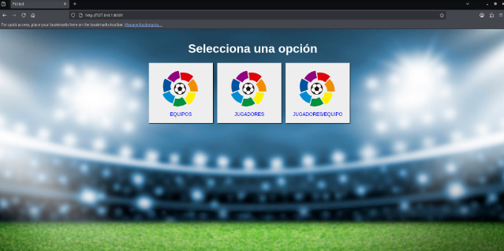
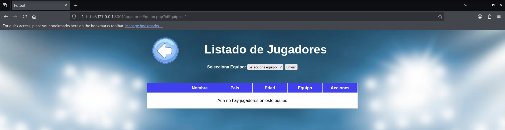
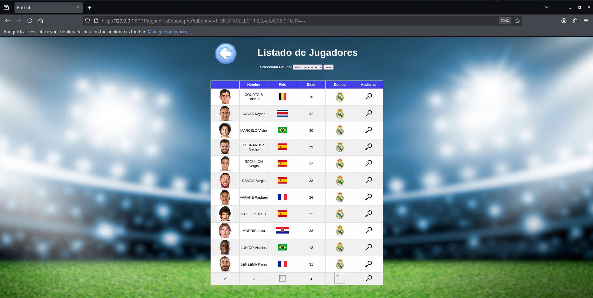
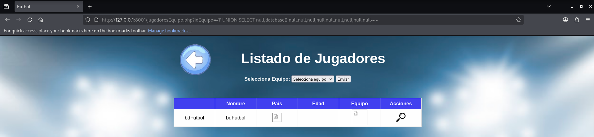
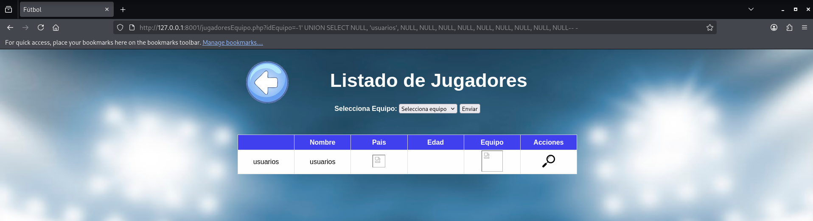
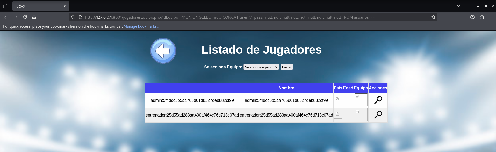
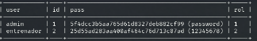
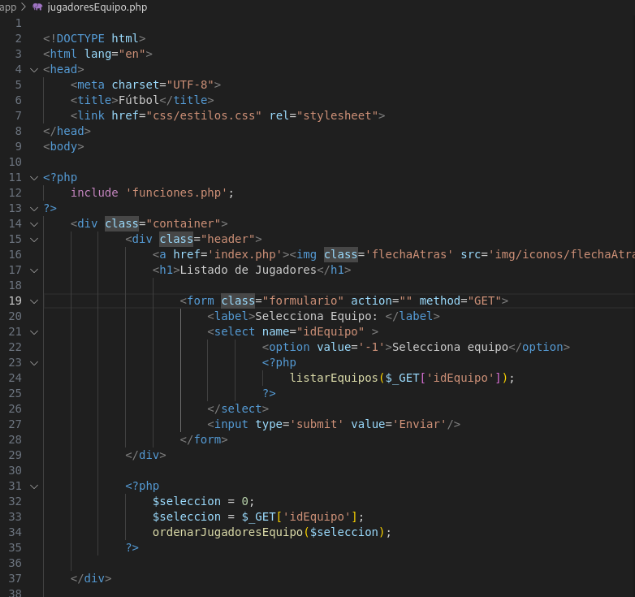

# Informe Técnico – Explotación y Mitigación de SQL Injection

## 1. Introducción
En este proyecto se ha realizado una auditoría de seguridad sobre una aplicación web dockerizada vulnerable a SQL Injection.

El objetivo ha sido identificar la vulnerabilidad, explotarla manualmente y mediante automatización, y finalmente proponer una solución segura.

---

## 2. Entorno de trabajo
- Máquina atacante: Kali Linux
- Aplicación objetivo: contenedor Docker (fútbol)
- Herramienta de explotación: SQLMap
- IDE: Visual Studio Code

```bash
sudo docker run -p 8001:80 franjimenez/futbol
```



---

## 3. Identificación del punto vulnerable
Se detectó que el parámetro GET `idEquipo` era vulnerable a SQL Injection.

La vulnerabilidad se comprobó introduciendo una comilla simple (`'`) en la URL.



---

## 4. Explotación manual

### 4.1 Enumeración de columnas
Se utilizó una consulta UNION para determinar el número de columnas utilizadas por la consulta SQL interna.

```sql
UNION SELECT 1,2,3,4,5,6,7,8,9,10,11
```



---

### 4.2 Obtención de la base de datos
Se utilizó la función `database()` para identificar la base de datos en uso.



---

### 4.3 Enumeración de tablas
Se identificaron las tablas:
- equipos
- jugadores
- usuarios



---

### 4.4 Extracción de usuarios y hashes
Se consiguió extraer información sensible de la tabla `usuarios`, incluyendo nombres de usuario y hashes de contraseñas.



---

## 5. Explotación automatizada con SQLMap
Posteriormente se automatizó la explotación mediante SQLMap.

Se realizaron:
- enumeración de bases de datos
- extracción de tablas
- extracción de columnas
- dump de credenciales



---

## 6. Revisión del código fuente
Se revisó el código fuente de la aplicación y se identificó el uso inseguro de parámetros GET directamente en consultas SQL.



---

## 7. Mitigación
La solución propuesta consistió en sustituir consultas vulnerables por consultas preparadas.

Ejemplo:
```php
$stmt = $conn->prepare("SELECT * FROM jugadores WHERE idEquipo = ?");
$stmt->bind_param("i", $idEquipo);
```


---

## 8. Impacto
La vulnerabilidad permitía:
- acceso no autorizado a información sensible
- extracción de usuarios y hashes
- posible compromiso de la base de datos

---

## 9. Conclusión
Este proyecto demuestra cómo una mala gestión de parámetros GET puede derivar en una vulnerabilidad crítica de SQL Injection.

Además, se ha documentado tanto la explotación como la mitigación, aportando una visión completa del ciclo de seguridad.
