# Informe Técnico – Auditoría SQL Injection

## 1. Introducción
En este informe se documenta una auditoría de seguridad realizada sobre WebGoat, una aplicación web deliberadamente vulnerable.

El objetivo principal ha sido identificar y explotar vulnerabilidades de SQL Injection, evaluando su impacto y proponiendo medidas de mitigación.

---

## 2. Entorno de trabajo
- Máquina atacante: Kali Linux
- Objetivo: WebGoat (contenedor Docker)
- Proxy: Caido
- Herramienta automatizada: SQLmap

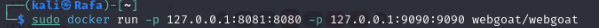
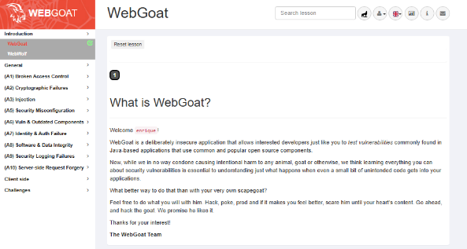

---

## 3. Identificación de la vulnerabilidad
Se identificó un campo de entrada vulnerable en el que los datos introducidos por el usuario se incorporaban directamente a una consulta SQL sin validación adecuada.

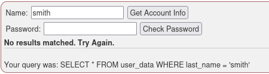

---

## 4. Explotación

### 4.1 Inyección DCL
Se utilizó una inyección DCL para modificar privilegios dentro de la base de datos.

**Payload utilizado:**
```sql
GRANT SELECT ON grant_rights TO unauthorized_user; --
```

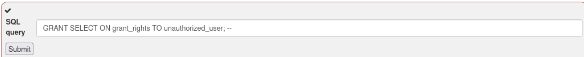

---

### 4.2 Inyección basada en UNION
Posteriormente se realizó una extracción de datos utilizando una inyección UNION-based.

**Payload:**
```sql
' UNION SELECT userid, user_name, password, '0','0','0',0 FROM user_system_data--
```

Esto permitió obtener credenciales, incluyendo:

- Usuario: Dave
- Contraseña: passW0rD

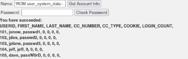

---

### 4.3 Interceptación de tráfico con Caido
Se interceptaron las peticiones HTTP utilizando Caido, permitiendo modificar manualmente los parámetros enviados al servidor.
Para ello tendremos que hacer un intento de consulta, dándole a **Get Account Info** como se muestra a continuación:

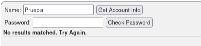

Ahora vamos a comprobar en CAIDO si se ha capturado la petición así que vamos a fijarnos en la ruta, es decir, el Path para saber lo que nos interesa.

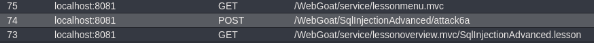

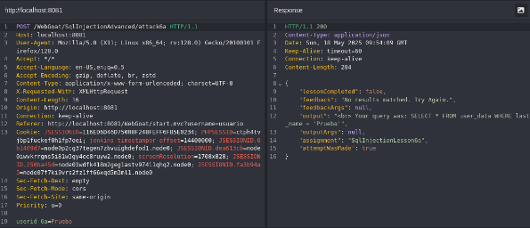

Aquí vamos a copiar y guardar la información de la izquierda para usarla con SQLMap más adelante.

---

### 4.4 Explotación automatizada con SQLmap
Finalmente, se utilizó SQLmap para automatizar la detección y explotación de la vulnerabilidad. Esto lo haremos como se muestra en la siguiente imagen, haciendo uso del fichero que guardamos anteriormente.

```bash
sqlmap -r webgoat -- level=5 --risk=3 --batch
```

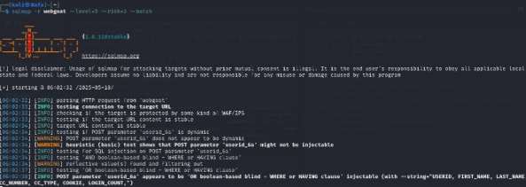
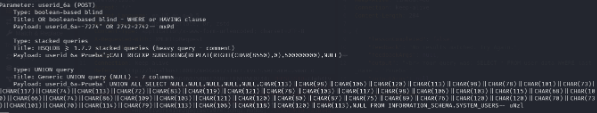

Sin embargo, a nosotros realmente nos interesa si el campo es vulnerable a una inyección basada en UNION así que vamos a usar SQLMap para comprobarlo.

```bash
sqlmap -r webgoat --technique=U --batch
```
Podemos comprobar que es vulnerable a UNION y que nos da un payload.

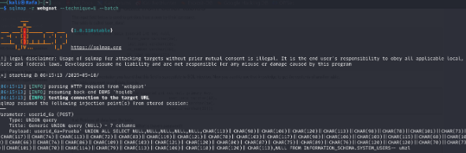

---

### 4.5 Explotación con CAIDO
Uso de CAIDO para interceptasr el paquete, cambiar la query y que se muestre lo que queramos.
Para ello vamos a entrar en el apartado **Intercept** y le daremos a **Forwarding**.

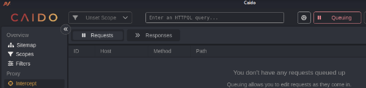

Volvemos a **WebGoat** tras colocar **CAIDO** en modo intercepción e insertando **Prueba** en el campo y dándole al botón de Get Account Info veremos que CAIDO ha interceptado la peticióon.

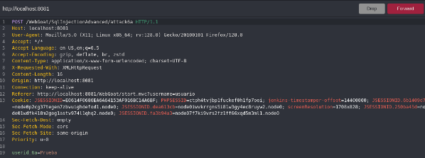

Vemos que ha interceptado la petición, así que ahora vamos a cambiar el campo userid_6a que se marca como Prueba que es lo que introducimos previamente y vamos a colocar la consulta UNION. 

```sql
' UNION SELECT userid, user_name, password, '0','0','0',0 FROM user_system_data--
```
Una vez modificado le daremos a **Forward** y volveremos a **WebGoat** para ver que se ha completado la consulta pero se ha cambiado Prueba por lo que introdujimos en CAIDO.

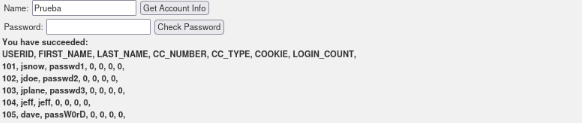

## 5. Impacto
La vulnerabilidad detectada puede permitir:

- Acceso no autorizado a información sensible
- Exposición de credenciales
- Escalada de privilegios
- Compromiso total de la base de datos

---

## 6. Medidas de mitigación
- Uso de consultas parametrizadas
- Validación y saneamiento de entradas
- Restricción de privilegios
- Auditorías periódicas de seguridad

---

## 7. Conclusión
La vulnerabilidad SQL Injection continúa siendo una de las más críticas en aplicaciones web.

Este proyecto demuestra cómo, mediante técnicas manuales y automatizadas, es posible comprometer la seguridad de una base de datos si no se aplican medidas preventivas adecuadas.
